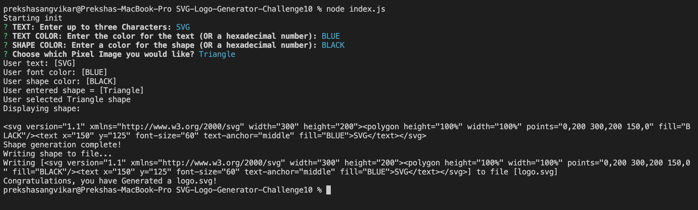
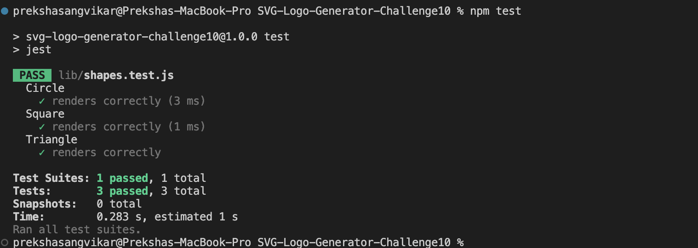

# SVG-Logo-Generator-Challenge10


## License
This project is licensed under the MIT license. For more information, see the [license link](https://opensource.org/licenses/MIT).
https://opensource.org/licenses/MIT

## Description
SVG Logo Maker is a command-line application that enables users to generate custom SVG logos. The application prompts users for input regarding text, colors, and shapes, then generates an SVG file based on the provided information. This tool is perfect for developers and designers looking to quickly create scalable vector logos.

## Table of Contents
* [Description](#description)

* [Usage Instructions](#usage-instructions)

* [Installation](#installation)

* [Features](#features)

* [Testing](#testing)

* [Demo](#Demo)

* [Questions](#questions)

## Usage Instructions
To use this application, follow these steps:

1. Clone the repository to your local machine using:
   ```bash

    git clone git@github.com:Preksha2408/SVG-Logo-Generator-Challenge10.git

2. Navigate to the project directory

    cd SVG-Logo-Generator-Challenge10

3. Install necessary dependencies 

   " npm install "

4. Through sequential order within the command line interface, the user will be presented with npm inquirer questions. The user will provide 
    a response to each question and proceed:

    *   Enter the text for the logo (e.g., company name or initials).
    *   Choose the text color.
    *   Choose a background shape (e.g., circle, square, triangle).
    *   Choose the background shape color.

5.  The generated SVG file will be saved in the project directory.

# Installation 

* npm init -y  

* npm install inquirer@8.2.4

* npm install jest@29.7.0

* npm install fs 


# Features

* Create custom SVG logos through a simple command-line interface.

* Choose text, text color, background shape, and shape color.

* Generates a scalable vector graphic (SVG) file based on user input.

# How to use this application 

*     

# Testing 

* Run " npm test "

     

# Demo 

* [Click here](https://drive.google.com/file/d/12k_Am8167lxMVvJp1KIhN8UokyJnBs8F/view?usp=drive_link)


# Questions 

For questions or further information, please contact me:

* [Email](mailto:prek.ps37@gmail.com?subject=[GitHub]%20Dev%20Connect)

* GitHub - [Preksha2408](https://github.com/Preksha2408/SVG-Logo-Generator-Challenge10.git)

